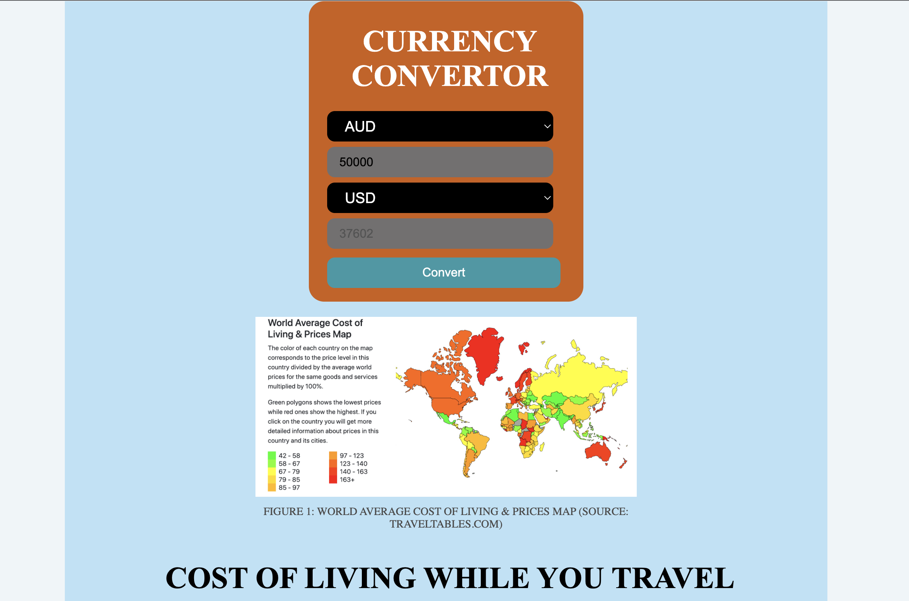
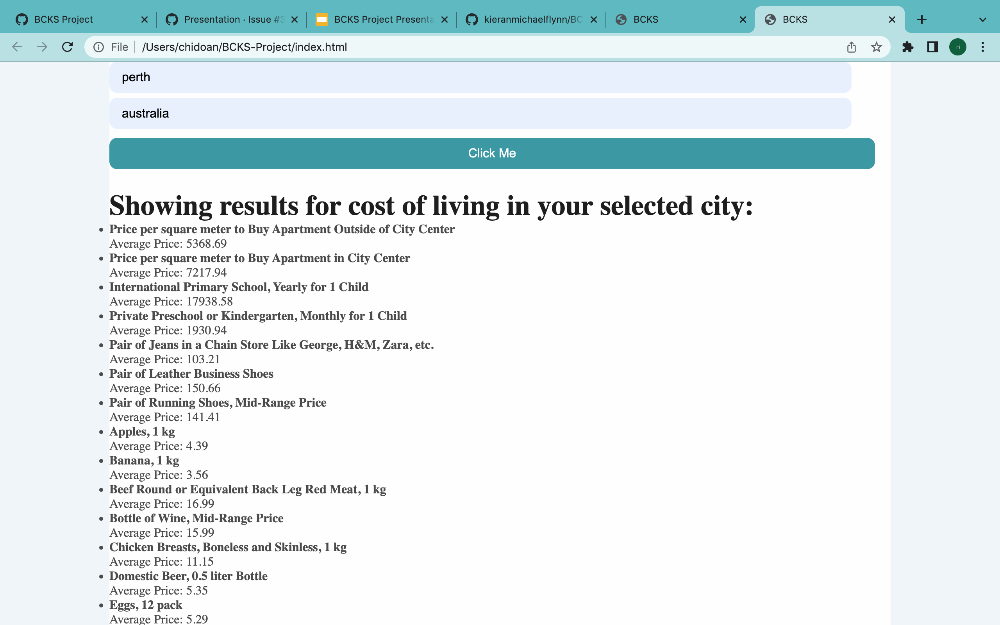
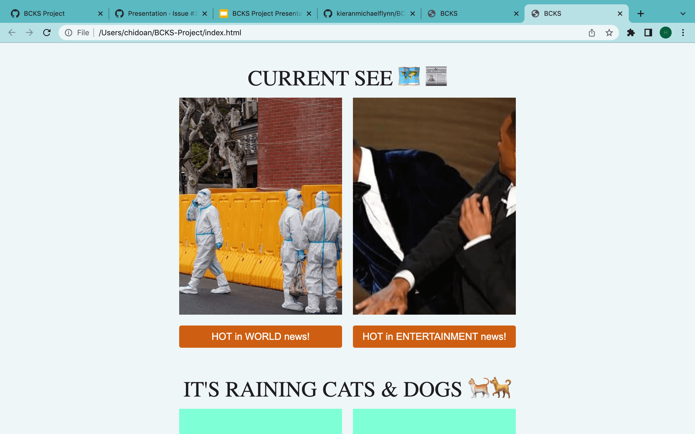
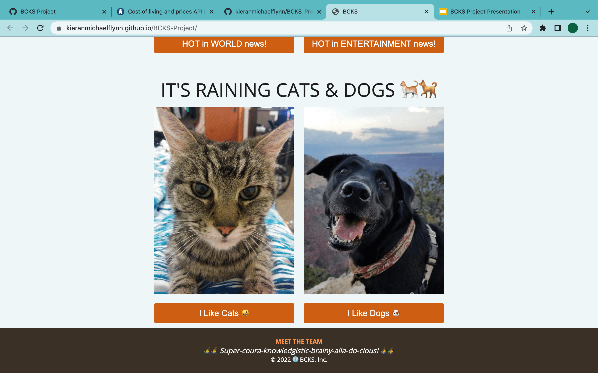
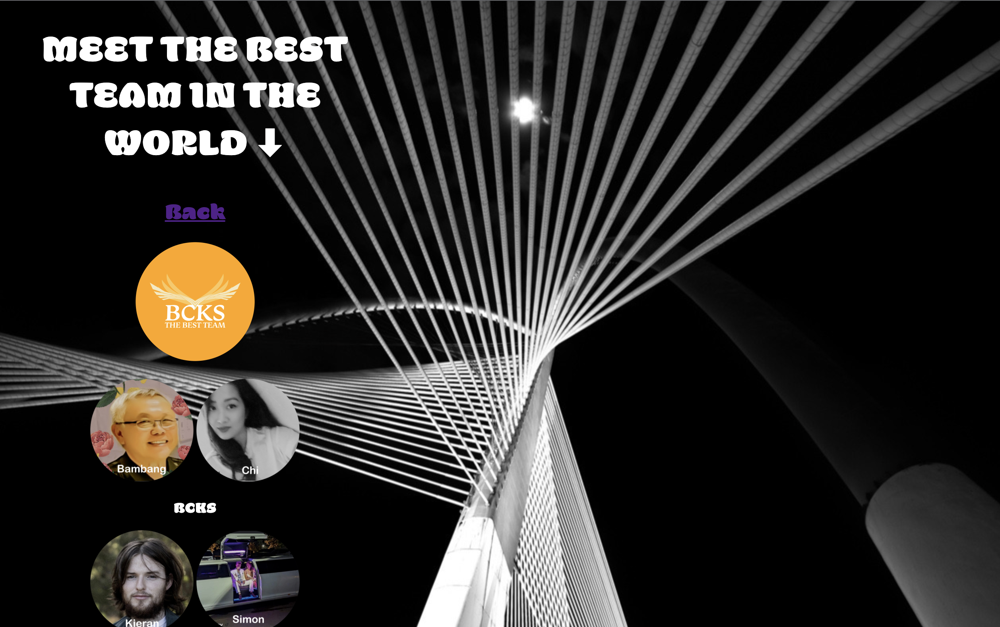

# BCKS-Project

**WELCOME TO BCKS 🚕🍸🚒🖕**

**BRAINY COURAGEOUS KNOWLEDGEABLE SUPERINDIVIDUALS**

*'We Bring you the latest, the greatest, info from around the globe!'*

**Our Mission**
Our aim is to develop a tool to help people gather valuable information regarding various topics such as travel, news, cats and dogs.

**Summary**
This was created as part of the UWA Coding Bootcamp Project 1 using HTML, CSS and Javascript. There was an emphasis on the use of API's (Application Programming Interface).

With contributions from the following collaborators:

Bambang: https://github.com/B-smd

Chi: https://github.com/hergemony

Kieran: https://github.com/kieranmichaelflynn

Simon: https://github.com/lev8947

**SCREENSHOTS**

1) A tool labelled 'Currency Convertor' is the first tool enabling users to select one type of currency and convert it to another.

2) Cost of living while travelling is displayed when user selects a desired destination (city and country). API call response should display a list of approx. 60 common goods and services for the destination, with 'item name' and 'average price' data points displayed.
![alt text] (https://github.com/kieranmichaelflynn/BCKS-Project/blob/main/images/Screen%20Shot%202022-04-02%20at%2010.01.00%20pm.png?raw=true)

3) An area for breaking news ('Current See') from two chose topics, world and entertainment news:
![alt text] (https://github.com/kieranmichaelflynn/BCKS-Project/blob/main/images/Screen%20Shot%202022-04-02%20at%2010.00.32%20pm.png?raw=true)

4) A light-hearted random Cat and Dog image generator is included:
![alt text] (https://github.com/kieranmichaelflynn/BCKS-Project/blob/main/images/Screen%20Shot%202022-04-02%20at%2012.33.51%20pm.png?raw=true)

**Javascript Features**
- Api calls for:
1) COST OF LIVING WHILE TRAVELLING
2) CURRENCY CONVERSION
3) BREAKING NEWS IMAGE GENERATOR
3) RANDOM CATS AND DOGS IMAGE GENERATOR - to cheer you up! 😃

**Github Repository Features**
- HTML Pages (index.html and aboutus.html)
- CSS Pages (Styles.css, reset.css, base.css)
- Javascript Pages (menu.js, news.js, catdogscript.js) Contains: * Variables, arrays, event listeners
- Screenshot of BCKS dashboard and API calls/results.

*Thank you for using our app!*

Github Profile Link => https://github.com/kieranmichaelflynn/BCKS-Project

Deployed Application Link => https://kieranmichaelflynn.github.io/BCKS-Project/

©️ 2022 🌐 BCKS, Inc. 